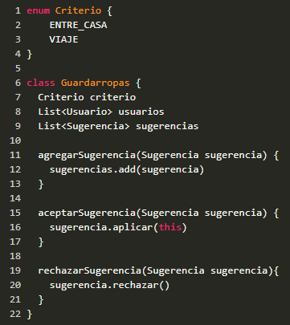
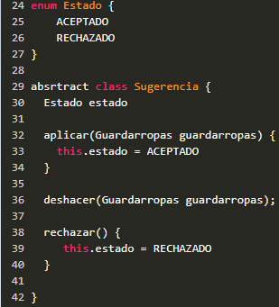
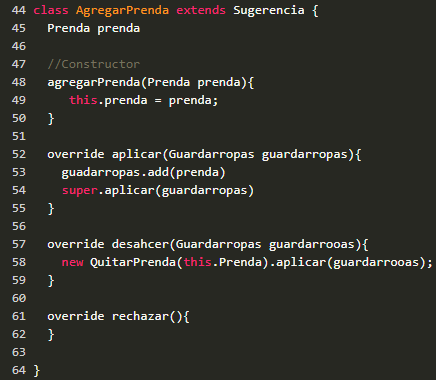
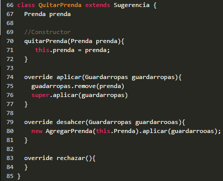

# Ejercicio Que Me Pongo Iteración 5

Aclaración, en esta entrega solo realicé el siguiente pseudocódigo (el codigo restante en el repo corresponde a entregas anteriores)

- Decidí modelar el guardarropas como una clase y el criterio como un enum:

  

- La sugerencia la modelo como un Command, utilizo clase abstracta para poder controlar el estado y definir template methods:
   
 
- Un primer Concrete Comand para modelar la operación de agregar una prenda:
   
  
- Un Segundo Concrete Comand para modelar la operación de quitar una prenda:
   
 
