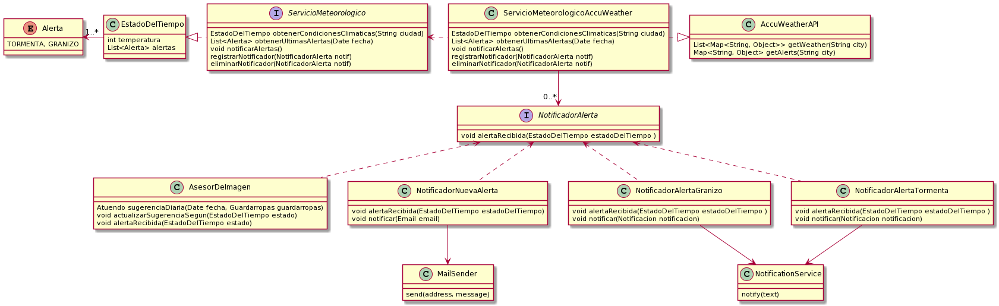

# Ejercicio Que Me Pongo Iteración 6

Aclaración, en esta entrega solo realicé el Diagrama (el codigo restante en el repo corresponde a entregas anteriores)

El ServicioMeteorologico de la entrega 5 ahora tiene la responsabilidad de obtener alertas.
Con la ayuda del patrón Observer, puede notificar a distintos individuos quienes toman diferentes acciones según corresponda.

      